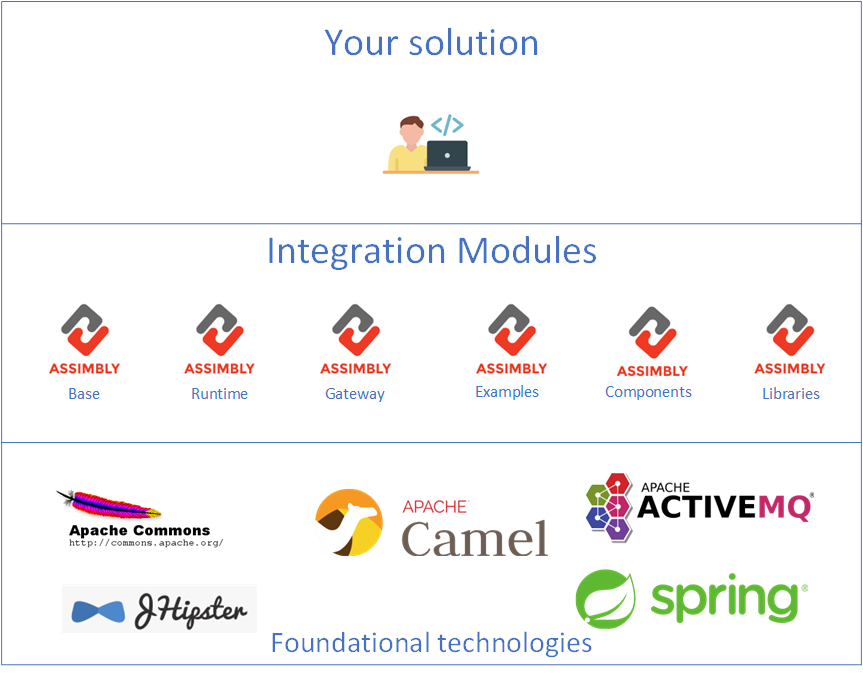

# About

Assimbly is an open source initiative started in 2018 by [Raymond Meester](https://www.linkedin.com/in/raymond-meester-475b79147/).
The [first commit](https://github.com/assimbly/gateway/blob/master/LICENSE) was adding the Apache Software License :smile:.

Since 2018 various projects were started to create [integration modules](/docs/category/modules). All projects are open source and the idea
 is that developers and organizations can pick the modules they need as part of their integration layer. 

The name Assimbly came from this idea. It comes both from **ASSIM** (A self-service integration module) and **to Assemble**. In other
words modules that you can self use in any integration solution.

# Concept

Assimbly stand on the shoulders of giants. It builds on other open source projects from the [Apache foundation](https://apache.org/) and other software like [JHipster](https://www.jhipster.tech/)
and [Spring](https://spring.io/).

On top of these foundational technologies integration solution are mades. The main engine behind Assimbly is the [Apach Camel](https://camel.apache.org/), a
powerful integration framework.

# Organization

Assimbly initially started in the Netherlands at the [Caesar groep](https://caesar.nl/). Over the years Assimbly has been developed and used by organizations like 
Caesar Groep, [Elanwave](https://www.elanwave.com/), [Wehkamp](https://www.wehkamp.nl/), [Renewi](https://www.renewi.com/nl-nl/), [SVB](https://www.svb.nl/nl/), it-masters and [Dovetail](https://www.dovetail.world/).

Since the end of 2021 Assimbly has been an independent project.

