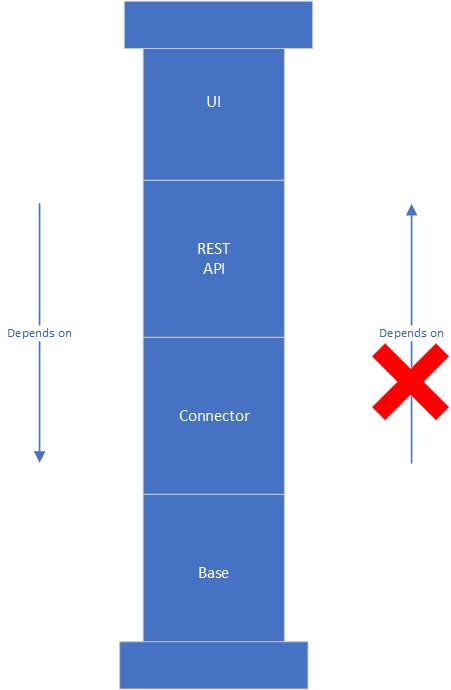
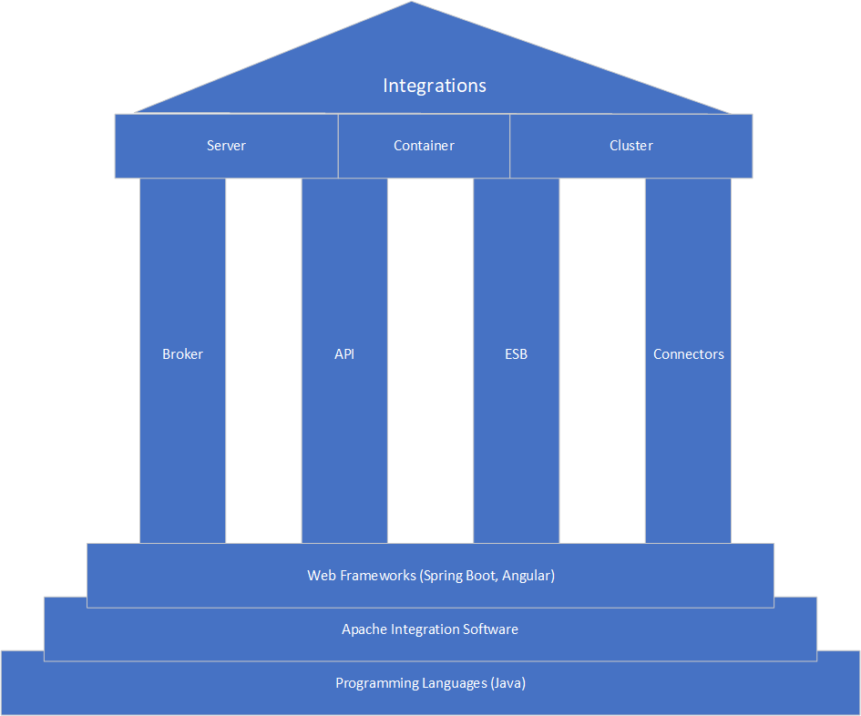

# Intro

In this section several Assimbly modules are explained.

## Integration functions

Assimbly is modular in design. Each module acts as a building block. Blocks 
build on top of other blocks. It depends on your use case what module you choose.

Here is an example to create a solution:

Multiple solutions creates a whole building:

In a [blog series on the architecture of Assimbly](https://raymondmeester.medium.com/architecture-of-assimbly-6e79fffc577d) this is explained in detail.