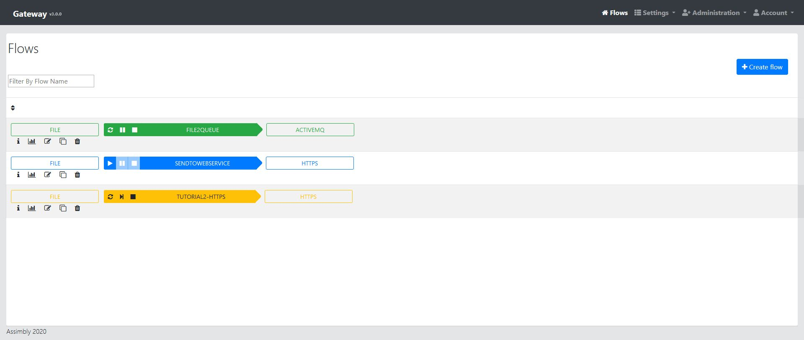

# Gateway

The gateway contains a user interface for the integration and broker runtime. It's the easiest way to start with Assimbly. 
It contains everything from the base, runtime and user interface.

https://github.com/assimbly/gateway/wiki/quick-start

## Configure

The gateway provide several ways to configure connectors, brokers and other integration functions.

## Manage

It's easy to manage configured integrations. You can start, stop or pause integrations from the browser.

## Documentation

The gateway is extensively documented on the Assimbly wiki:

https://github.com/assimbly/gateway/wiki

## Github repository

https://github.com/assimbly/gateway

