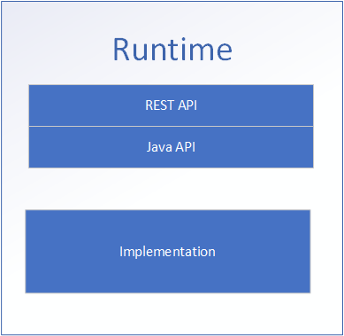

# Runtime

The runtime runs integration functions. Examples are:

1. connectors
2. services (ESB)
3. api's
4. brokers  

Each runtime has an implementation. For example a connector is implemented with Apache Camel and the broker is implemented with ActiveMQ. On top
of the implementation there two type of API's:

1. Java API
2. REST API

## Integration runtime

The integration runtime runs integrations. There are two modules:

1. Integration (The Java API)
2. IntegrationRest (The REST API)

The modules can be embedded into a Java application to provide interaction with the runtime through the API's.
The API's currently have one implementation, namely [Apache Camel](https://camel.apache.org/). 

 
## Broker runtime

The broker runtime runs message brokers (MQ). There are two modules:

1. Broker (The Java API)
2. BrokerRest (The REST API)

The modules can be embedded into a Java application to provide interaction with the runtime through the API's.
The API's currently have two implementations. One for [ActiveMQ Classic](https://activemq.apache.org/components/classic/) and one for [ActiveMQ Artemis](https://activemq.apache.org/components/artemis/). 

## Github repository

https://github.com/assimbly/modules